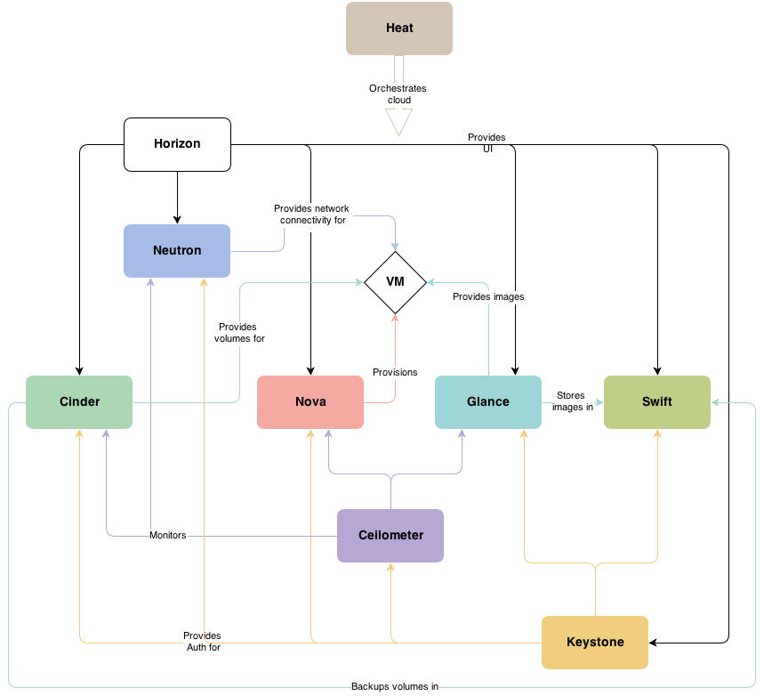
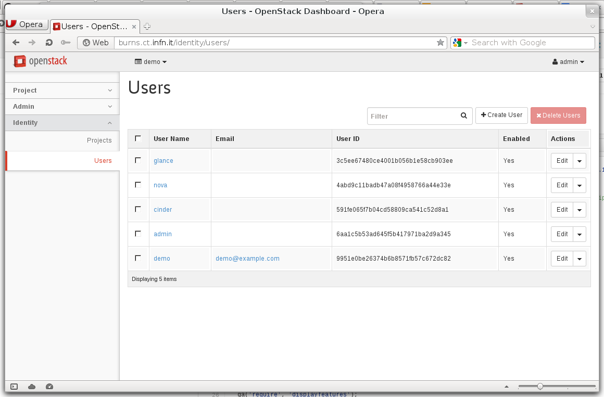

# keystone

*Dr Marco Fargetta*, INFN Catania

<span style="font-size:60%">marco.fargetta@ct.infn.it</span>

<span style="font-size:40%">CHAIN-REDS School on Cloud Computing. Catania, 13-18 April 2015</span>


## The identity management

- Keystone is the responsible for the identities inside OpenStack

- It grants the authorisation to the users before they can perform any operation

- Services need to communicate with Keystone





## User information

- **User**: represents a human user. Has associated information such as user name, password, and email

- **Group**: represents a collection of users. Roles can be assigned to groups and these are applied to all members

- **Project**: a context for users, roles and resources. For example, if you query the Compute service for a list of running instances, you get a list of all running instances in the project that you specified in your query

- **Domain**: defines administrative boundaries for the management of Identity entities


## Role and Policies

**Role** captures the operations that a user can perform. They have no
  special meaning inside Keystone but the services have to map each
  role with a specific action.

The mapping is done in a `policy.json` file like this

```javascript
{
    "admin_or_owner": [
        [
            "role:admin"
        ],
        [
            "project_id:%(project_id)s"
        ]
    ],
    "default": [
        [
            "rule:admin_or_owner"
        ]
    ],
    "compute:create": [
        "role:compute-user"
    ],
    "compute:create:attach_network": [
        "role:compute-user"
    ],
    "compute:create:attach_volume": [
        "role:compute-user"
    ],
    "compute_extension:admin_actions:pause": [
        [
            "rule:admin_or_owner"
        ]
    ],
    ....
```


## Service Catalog

- Keystone maintain the list of services available in the cloud

- This is used by users and services to get the service entry points

- It is possible to organise entry points in regions

- The Identity Service also maintains a user that corresponds to each service, such as, a user named nova for the Compute service, and a special service tenant called service


## Modular architecture

- Default installation require a *MySql* database to store identity and other information

- Back-end module is divided in identity and assignments
    - **Identity** stores users and groups
    - **Assignment** stores domains, projects, roles and role assignment 

- Identity information can be maintained in a external server
    - *LDAP and Active Directory can be associated to Keystone*


## User Authentication

- Default authentication based on **_username_** and **_password_**

- Credentials maintained in the database or retrieved from the corporate directory service


## Token

- If the user is authenticate a token is released

- The token can be *scoped* or *unscoped*
    - Scoped token are associated to a specific project
    - Unscoped token are generally released with the credentials and used to retrive scoped token

- The token identify the user and his/her roles inside OpenStack


## Token format

- Two main types of token: **UUID** and **PKI**
    - UUID tokens contain only an id which keystone can use to retrieve information
    - PKI tokens are documents with all the information signed with a x509 certificate

- In both case the token is bearer: <span style="color:#F00;">**who get the token is the user**</span>


## Which token format to use

- Default is PKI

- UUID tokens require more communication with keystone because services need to retrieve the user and the roles associated

- PKI tokens are much bigger so the will consume some bandwidth and computing power for the verification

- PKI should be preferred but it need to evaluated according to the site requirements


## External authentication

- Username and password are not the only alternatives

- If executed behind a web server it is possible to use any authentication system supported using the external authentication plug-in
    - The plug-in read the information of the `REMOTE_USER` variable

- The user has to exist in the back-end


## Federated authentication

- In Juno release a new plug-in was introduced to allow SAML based authentication

- Several limitation in real use:
    - Supports only ECP profile: <span style="color: #B26">available only from command line</span>
    - Requires the manual registration of all the IdPs in federation
    - Attribute maps not flexible
        - no regular expression and/or other mechanisms to manipulate the information


## Next release

- Federation plug-in revised in Kilo

- Support for WEB SSO included

- More freedom to link IdPs with mapping rules

- Support for Open-ID integrated


## Enabling the federation

- Authentication has to be managed by a web server
    - From Kilo it is recommended to run keystone behind a web server and in future this will be the only option

- Keystone plug-in retrieve the user information from the server and create a token
    - SAML attributes are translated inside keystone (generating user name, roles, etc...) using a map file

- IdPs and mapping need to be registered before they can be used for authentication


## Interacting with keystone: CLI

- Previous version of Keystone use the `keystone` client. Es.

```
$ openstack user-list
$ openstack user-create --name user1 --email user1@mail.com --enabled true --tenant demo
```

- From Juno the CLI of all services move to the `openstack` client
    - In Kilo the `keystone` client is deprecated
    - Documentation is not yet fully updated. You will find a mix of `keystone` and `openstack` commands in the examples


## CLI Example

```
$ export OS_AUTH_PLUGIN=v3password
$ export OS_PROJECT_NAME=demo
$ export OS_IDENTITY_API_VERSION=3
$ export OS_AUTH_URL=https://burns.ct.infn.it/v3
$ export OS_USERNAME=admin
$
$ openstack user list
+----------------------------------+--------+
| ID                               | Name   |
+----------------------------------+--------+
| 3c5ee67480ce4001b056b1e58cb903ee | glance |
| 4abd9c11badb47a08f4958766a44e33e | nova   |
| 591fe065f7b04cd58809ca541c52d8a1 | cinder |
| 6aa1c5b53ad645f5b417971ba2d9a345 | admin  |
| 9951e0be26374b6b8571fb57c672dc82 | demo   |
+----------------------------------+--------+
$ 
```


## Interacting with keystone: Dashboard




## References

- OpenStack Cloud Administrator Guide [http://docs.openstack.org/admin-guide-cloud/content/index.html](http://docs.openstack.org/admin-guide-cloud/content/index.html)

- OpenStack Admin User Guide [http://docs.openstack.org/user-guide-admin/content/index.html](http://docs.openstack.org/user-guide-admin/content/index.html)


<span style="font-size: 300%; font-weight: bold">Thanks!!!</span>